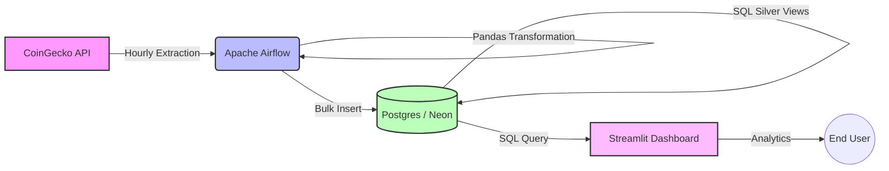

# ₿ What-price | Crypto Analytics 🔍
**End-to-End Cryptocurrency Market Intelligence Pipeline**

An end-to-end data engineering project that automates the extraction of real-time market data from CoinGecko, processes it through a Bronze/Silver medaillon-inspired architecture, and provides deep insights into price trends, volatility, and liquidity through a high-contrast dark mode dashboard.


## 🏗️ Architecture

The project follows a modern ETL architecture managed within a monorepo structure, using an hourly frequency to capture the high volatility of the crypto market.



### Data Flow

1. **Ingestion (Extract):** Apache Airflow (TaskFlow API) calls the CoinGecko V3 API to fetch the top 20 cryptocurrencies hourly.
    
2. **Processing (Transform):** Cleaning JSON data, handling nulls, and preparing records for relational storage using **Pandas**.
    
3. **Storage (Load):** Idempotent ingestion (`ON CONFLICT DO NOTHING`) into a **PostgreSQL** database (Neon).
    
4. **Analytics (Silver Layer):** SQL Views pre-calculate complex metrics like 24h volatility, market dominance, and supply utilization.

## 🛠️ Tech Stack

|**Component**|**Technology**|**Description**|
|---|---|---|
|**Orchestration**|Apache Airflow 3 (Astro)|Manages DAGs, Hourly Schedules, and Resiliency.|
|**Database**|PostgreSQL (Neon)|Serverless Bronze/Silver layer storage.|
|**ETL Engine**|SQLAlchemy, Python|Data manipulation and schema enforcement.|
|**Frontend**|Streamlit|Interactive Web App with Plotly visuals.|
|**DevOps**|Docker Compose|Local isolation for Airflow services.|

## 📂 Data Source & Schema

**Source:** [CoinGecko API](https://www.coingecko.com/en/api) (Free Tier)

### Database Schema (`public.crypto_market_bronze`)

|**Column Name**|**Data Type**|**Description**|
|---|---|---|
|`id`|`BIGINT`|Primary Key (Identity)|
|`coin_id`|`VARCHAR(50)`|API Unique ID (e.g., bitcoin)|
|`symbol`|`VARCHAR(20)`|Ticker (BTC, ETH)|
|`current_price`|`NUMERIC`|Current price in USD|
|`market_cap`|`BIGINT`|Market capitalization|
|`total_volume`|`BIGINT`|24h trading volume|
|`volatility_24h_pct`|`NUMERIC`|Daily price range relative to price|
|`quote_timestamp`|`TIMESTAMP`|Last API update time|
|`processing_date`|`TIMESTAMP`|ETL ingestion metadata|

## 🚀 How to Run Locally

### 1. Configure environment variables
```bash
cp .env_example .env
# Fill in your POSTGRES_URL (Neon DB)
```

### 2. Database Migration
Run the crypto migration on your database:
```bash
psql $POSTGRES_URL -f migrations/002_setup_crypto_tables.sql
```

### 3. Start Airflow (ETL)
```bash
cd whatprice-airflow
docker compose up -d
```
_Access Airflow UI at: `http://localhost:8080` (admin/admin)_

### 4. Start Dashboard
```bash
cd ../dashboard
pip install -r requirements.txt
streamlit run app.py
```

## 📊 Visualizations
The dashboard features multiple analytical lenses:
- **Market Dominance**: Treemap visualization of market cap shares.
- **Performance Index**: Base-100 normalized trend comparison.
- **Liquidity Map**: Scatter plot of Volume vs Market Cap.
- **Tokenomics**: Supply utilization and ATH (All-Time High) distance.

## 👨‍💻 Author
**João Gabriel Saraiva** - _Data Engineer_
