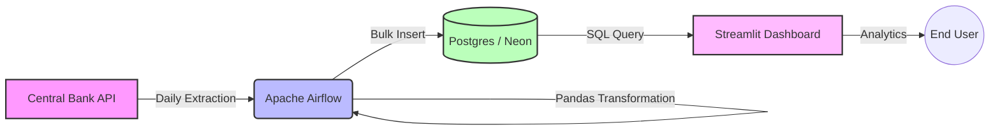

# 💰 What-price ETL ⚙️
**End-to-End Currency Exchange Pipeline**

An end-to-end data engineering project that automates the extraction of historical and actuals currency rates from the Central Bank of Brazil, processes the data for analytical readiness, and visualizes market trends through an interactive dashboard.


### Live link to app: [WhatPrice ETL](https://whatprice-etl.streamlit.app/)


## 🏗️ Architecture

The project follows a modern ETL (Extract, Transform, Load) architecture managed within a monorepo structure.



### Data Flow

1. **Ingestion (Extract):** Apache Airflow (TaskFlow API) extracts daily CSV files from the Central Bank.
    
2. **Processing (Transform):** Data cleaning, typing (Numeric precision), and normalization using **Pandas**.
    
3. **Storage (Load):** Optimized ingestion (Bulk Insert) into a **PostgreSQL** database hosted on **Neon Tech** (Serverless).
    
4. **Visualization:** Interactive dashboard built with **Streamlit** and **Plotly** to monitor spread and volatility.
    

## 🛠️ Tech Stack

This project was built using industry-standard tools for Data Engineering:

|**Component**|**Technology**|**Description**|
|---|---|---|
|**Orchestration**|Apache Airflow(Astronomer)|Manages DAGs, Retries, and Backfilling.|
|**Database**|PostgreSQL|Bronze/Silver layer storage.|
|**ETL Engine**|SQLAlchemy, Python, SQL|Data manipulation and schema enforcement.|
|**Frontend**|Streamlit|Interactive Web App for analytics.|
|**DevOps**|Docker Compose|Local development environment for Airflow.|

## 📂 Data Source & Schema

**Source:** Banco Central do Brasil (BCB)

**Format:** `.csv` (Daily Files)

**Example URL:** `http://www4.bcb.gov.br/Download/fechamento/20251202.csv`

### Database Schema (`public.currency_quotes_bronze`)

|**Column Name**|**Data Type**|**Description**|
|---|---|---|
|`id`|`BIGINT`|Primary Key (Identity)|
|`quote_date`|`TIMESTAMP`|Date of the quote|
|`currency_code`|`VARCHAR(10)`|ISO Numeric Code (e.g., 790)|
|`type`|`VARCHAR(5)`|Type A (Buy/Sell) or B|
|`currency`|`VARCHAR(5)`|Currency Symbol (e.g., USD, EUR)|
|`buy_rate`|`NUMERIC(20,10)`|Buying rate|
|`sell_rate`|`NUMERIC(20,10)`|Selling rate|
|`parity_buy`|`NUMERIC(20,10)`|Parity for purchase|
|`parity_sell`|`NUMERIC(20,10)`|Parity for sale|
|`processing_date`|`TIMESTAMP`|ETL Ingestion Metadata|

### 🗄️ Database Setup

Before running the DAG for the first time, execute the migration on your Neon database:

```bash
# Using psql (replace with your Neon connection string)
psql $POSTGRES_URL -f migrations/001_setup_bronze_table.sql
```

Or copy-paste the contents of [`migrations/001_setup_bronze_table.sql`](migrations/001_setup_bronze_table.sql) directly in the [Neon SQL Editor](https://console.neon.tech/).

This migration:
- Creates `currency_quotes_bronze` table (idempotent — safe to re-run)
- Adds `UNIQUE(quote_date, currency_code, type)` — required for `ON CONFLICT DO NOTHING`
- Creates performance indexes on `quote_date` and `currency`
- Creates the `currency_quotes_silver` view with pre-computed spread and parity metrics

## 🚀 How to Run Locally

### Prerequisites

- [Docker](https://www.docker.com/products/docker-desktop/) & Docker Compose
- Python 3.9+ (for the dashboard only)

### 1. Clone the repository

```bash
git clone https://github.com/jsaraivx/what-price.git
cd what-price
```

### 2. Configure environment variables

```bash
cp .env_example .env
```

Fill in your Neon DB credentials in the `.env` file. Be sure to also set `AIRFLOW_CONN_PG_CONN` (following the example) to avoid configuring the connection manually in the UI later.

##### Generate a secure Airflow 3 secret key:
Airflow 3 requires a url-safe base64 string for internal API JWT authentication. Generate it with:
```bash
python3 -c "import base64, os; print(base64.urlsafe_b64encode(os.urandom(32)).decode('utf-8'))"
# Paste the result as AIRFLOW_SECRET_KEY in .env
```

### 3. Start Airflow (ETL)

```bash
cd whatprice-airflow
docker compose up -d
```

_Access Airflow UI at: `http://localhost:8080`_

```
User:     admin
Password: admin
```

### 4. Configure the Airflow Connection (Neon DB)

**Automated Setup (Recommended):**
If you placed the `AIRFLOW_CONN_PG_CONN` variable in your `.env` file, Airflow will automatically hook up to the database on start, requiring no action on your part.

**Alternative (Manual Setup UI):**
Create a Postgres connection in the Airflow UI under **Admin → Connections**:


| Field | Value |
|---|---|
| Connection Id | `pg_conn` |
| Connection Type | `Postgres` |
| Host | your Neon host |
| Schema | your DB name |
| Login / Password | your Neon credentials |
| Port | `5432` |

### 5. Start Dashboard

```bash
cd ../dashboard
pip install -r requirements.txt
streamlit run app.py
```

_Access Dashboard at: `http://localhost:8501`_

### Useful Docker Commands

```bash
docker compose logs -f             # follow all logs
docker compose logs airflow-scheduler -f   # scheduler logs only
docker compose down                # stop everything
docker compose down -v             # stop and delete volumes (full reset)
```

## 📊 Visualizations

The dashboard provides real-time insights into market volatility and exchange rate spreads.

## ⚡ Smart Catchup & Resiliency
The DAG (`what_price_etl`) is optimized for robustness under Airflow 3 (LocalExecutor):
- **Dynamic Start Date**: The DAG queries your NeonDB for the most recent data loaded (`MAX(quote_date)`) and dynamically shifts its `start_date`. This avoids heavy 2020-backfills every time you reset the project container.
- **24-Hour Cache**: The dynamic date is cached locally preventing abusive querying on your free-tier database due to Airflow's 30s DAG parser.
- **API Resiliency**: Safely skips extraction during weekends and Brazilian holidays utilizing `AirflowSkipException`.
- **Duplicate Prevention**: Ingestion relies on `ON CONFLICT DO NOTHING` for idempotency on manual runs.

## 📚 References & Documentation

- [Airflow TaskFlow API Tutorial](https://airflow.apache.org/docs/apache-airflow/stable/tutorial/taskflow.html)
    
- [Airflow Templates Reference](https://airflow.apache.org/docs/apache-airflow/stable/templates-ref.html)
    
- [BCB Data Portal](https://dadosabertos.bcb.gov.br/)
    

## 👨‍💻 Author

**João Gabriel Saraiva** - _Data Engineer_
