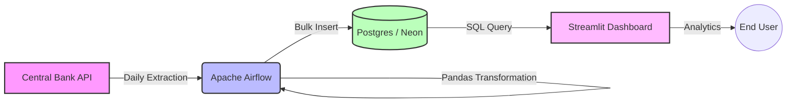
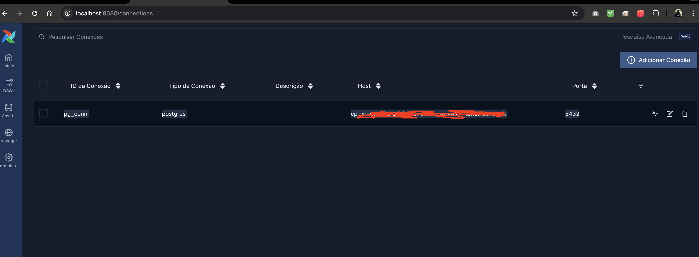

# 💰 What-price ETL ⚙️
**End-to-End Currency Exchange Pipeline**

An end-to-end data engineering project that automates the extraction of historical and actuals currency rates from the Central Bank of Brazil, processes the data for analytical readiness, and visualizes market trends through an interactive dashboard.


## 🏗️ Architecture

The project follows a modern ELT (Extract, Load, Transform) architecture managed within a monorepo structure.



### Data Flow

1. **Ingestion (Extract):** Apache Airflow (TaskFlow API) extracts daily CSV files from the Central Bank.
    
2. **Processing (Transform):** Data cleaning, typing (Numeric precision), and normalization using **Pandas**.
    
3. **Storage (Load):** Optimized ingestion (Bulk Insert) into a **PostgreSQL** database hosted on **Neon Tech** (Serverless).
    
4. **Visualization:** Interactive dashboard built with **Streamlit** and **Plotly** to monitor spread and volatility.
    

## 🛠️ Tech Stack

This project was built using industry-standard tools for Data Engineering:

|**Component**|**Technology**|**Description**|
|---|---|---|
|**Orchestration**|Apache Airflow(Astronomer)|Manages DAGs, Retries, and Backfilling.|
|**Database**|PostgreSQL|Bronze/Silver layer storage.|
|**ETL Engine**|SQLAlchemy, Python, SQL|Data manipulation and schema enforcement.|
|**Frontend**|Streamlit|Interactive Web App for analytics.|
|**DevOps**|AstroCLI|Containerization for local development.|

## 📂 Data Source & Schema

**Source:** Banco Central do Brasil (BCB)

**Format:** `.csv` (Daily Files)

**Example URL:** `http://www4.bcb.gov.br/Download/fechamento/20251202.csv`

### Database Schema (`public.currency_quotes_bronze`)

|**Column Name**|**Data Type**|**Description**|
|---|---|---|
|`id`|`BIGINT`|Primary Key (Identity)|
|`quote_date`|`TIMESTAMP`|Date of the quote|
|`currency_code`|`VARCHAR(10)`|ISO Numeric Code (e.g., 790)|
|`type`|`VARCHAR(5)`|Type A (Buy/Sell) or B|
|`currency`|`VARCHAR(5)`|Currency Symbol (e.g., USD, EUR)|
|`buy_rate`|`NUMERIC(20,10)`|Buying rate|
|`sell_rate`|`NUMERIC(20,10)`|Selling rate|
|`parity_buy`|`NUMERIC(20,10)`|Parity for purchase|
|`parity_sell`|`NUMERIC(20,10)`|Parity for sale|
|`processing_date`|`TIMESTAMP`|ETL Ingestion Metadata|

## 🚀 How to Run Locally

### Prerequisites

- Docker & Docker Compose
    
- Python 3.9+
    
- Astro CLI (Optional, but recommended)
    

### 1. Clone the repository

Bash

```
git clone [https://github.com/YOUR_USERNAME/currency-exchange-etl.git](https://github.com/YOUR_USERNAME/currency-exchange-etl.git)
cd currency-exchange-etl
```

### 2. Start Airflow (ETL)

Using Astro CLI (Recommended):

Bash

```
cd airflow
astro dev start
```

_Access Airflow UI at: `http://localhost:8080`_

Login with acess:
```bash
User: admin
Password: admin
```

### 3. Config the Airflow Connections / .env

You need to set a Connection with type Postgres, for connect with your DB.


##### You NEED to config '.env' file before continue, for this, use '.env_example' as template.

### 4. Start Dashboard

Bash

```
cd ../dashboard
pip install -r requirements.txt
streamlit run app.py
```

_Access Dashboard at: `http://localhost:8501`_

## 📊 Visualizations

The dashboard provides real-time insights into market volatility and exchange rate spreads.

**For default, the ETL will extract data from API for dates after 2020-01-01.**

**You can change this in dag file.**

## 📚 References & Documentation

- [Airflow TaskFlow API Tutorial](https://airflow.apache.org/docs/apache-airflow/stable/tutorial/taskflow.html)
    
- [Airflow Templates Reference](https://airflow.apache.org/docs/apache-airflow/stable/templates-ref.html)
    
- [BCB Data Portal](https://dadosabertos.bcb.gov.br/)
    

## 👨‍💻 Author

**João Gabriel Saraiva** - _Data Engineer_